# GKE Cloud Engineering Lab

> **Ephemeral portfolio project:** this repository is the durable artifact. The
> Google Cloud environment is created only for a documented demonstration and is
> destroyed after evidence is collected.

This project demonstrates how to design, provision, secure, observe, test, break,
recover, and remove a Google Kubernetes Engine platform. It is built bottom-up:
every layer ships with continuous integration, a live contract test, a negative
test, evidence collection, and a cleanup check before the next layer is allowed to
run.



## What this proves

| Capability | Demonstration |
| --- | --- |
| Infrastructure as code | Layered Terraform state, reusable modules, drift-safe plans, and reverse-order teardown |
| Cloud networking | Private GKE nodes, VPC-native ranges, Private Google Access, Gateway API, TLS, Cloud Armor, and an opt-in NAT lab |
| Kubernetes operations | Workload Identity, Dataplane V2, policies, HPA, cluster autoscaling, PDBs, upgrades, and recovery |
| Software supply chain | Cloud Build, Artifact Registry, SBOM/provenance, Binary Authorization, and digest-only deployments |
| Delivery engineering | Cloud Deploy progression from staging to production with verification and approval |
| Reliability | Pub/Sub redelivery, idempotent GCS writes, optional Cloud SQL recovery, Backup for GKE, and controlled failure labs |
| Operations | Structured logs, metrics, traces, dashboards, alerts, runbooks, evidence, cost controls, and zero-resource verification |

## Build order

```text
tooling -> bootstrap -> network -> platform -> private GKE -> addons/policies
        -> internal workloads -> signed staging delivery -> public edge
        -> optional recovery profile -> failure labs -> teardown verification
```

Production promotion is an explicit protected action after staging verification,
not an automatic side effect of provisioning.

CI validates each layer as it is introduced. The protected live workflow runs
exactly one plan, apply, or verify operation and cannot skip a missing, stale,
failed, or expired prerequisite gate. Public, paid, production, destructive,
and final-delete stages use protected GitHub environments.

## Quick navigation

- [Executive case study](docs/executive-summary.md)
- [Architecture](docs/architecture.md)
- [Repository map](docs/repository-map.md)
- [Bottom-up build and CI gates](docs/build-order.md)
- [Service catalog](docs/service-catalog.md)
- [Security model](docs/security-model.md)
- [Testing and failure labs](docs/test-strategy.md)
- [Public test-image choices](docs/public-test-images.md)
- [Cost and teardown](docs/cost-and-teardown.md)
- [Sanitized evidence index](evidence/index.md)
- [Recruiter walkthrough](docs/recruiter-walkthrough.md)
- [Interview talking points](docs/interview-talking-points.md)

## Operator interface

Run the project from its Dev Container. The Make targets are intentionally small
wrappers over inspectable scripts:

```bash
make validate
make hooks
make test-layer LAYER=1
make plan-layer LAYER=1 PROFILE=core
make apply-layer LAYER=1 PROFILE=core
make verify-layer LAYER=1 PROFILE=core
CONFIRM_DESTROY=layer-2 make destroy-layer LAYER=2 PROFILE=core
make lab NAME=image-pull-failure
make evidence
make teardown-runtime
make verify-zero-cost
make teardown-final
```

`make test-layer` is the development loop. Planning never applies or publishes
a passing live gate. After reviewing the saved plan and its manifest,
`make apply-layer` applies that exact plan; `make verify-layer` runs the live
contract and rejects post-apply drift. A prerequisite is reusable only when its
gate status is `verified`.

Bulk provision-through and full-lab apply are disabled while the platform is
being hardened. Each layer is implemented, tested, reviewed, merged, and live
verified before work begins on the next layer.

The Dev Container image bakes in the pinned security tools so Docker can reuse
that build layer. Named volumes persist GitHub CLI and Google Cloud CLI
authentication, Go modules, Go build output, Terraform providers, TFLint
plugins, and Trivy policies across ordinary container rebuilds. Use **Rebuild
Container** to retain Docker's build cache; **Rebuild Container Without Cache**
intentionally downloads everything again. Deleting the named volumes also
removes their cached data and CLI logins.

Run `bash scripts/check-devcontainer.sh --require-auth` after a rebuild to verify
the complete command set, persistent volumes, GitHub CLI login, and gcloud
Application Default Credentials.

Normal provisioning and delivery never require a manual `kubectl apply`.
`kubectl` is used for observation and tightly bounded failure injection only.

## Current status

The repository implements the platform, application, test, CI, documentation,
and teardown contracts. A live run still requires a dedicated GCP project,
billing-account selection, GitHub environment approvals, and repository-specific
image digests. Those values are deliberately not committed.
